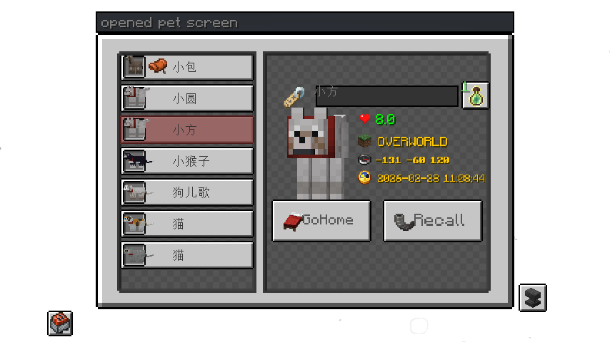

# PetManager

---

---
## Detailed Introduction
Provides a universal pet terminal, similar to those in online games.
Features include:
1. Records tamed pets
2. Teleports pets to your current location
3. Teleports pets to your set home location
4. Rename your pets (This costs 1 level of experience points, not a direct level reduction)
5. Optional pet data recording: If you no longer wish to record a pet, click the TNT Minecart icon to de-register it. Click the Anvil icon, then the Lava Bucket icon to view de-registered pets, where clicking the TNT Minecart icon can cancel the de-registration.
6. Toggle friendly fire on or off

---
## About This Project:
Due to unforeseen circumstances, the project has been released early. It is still in a beta version, not yet complete, and may contain some bugs; please report any issues.
It is only an auxiliary mod and will not alter your world; it only changes your pets' locations when active. You can safely add or remove it.

---
## Possible Future Plans
1. Add death protection
2. Optimize safer teleportation logic
3. Add extra support for mounts (e.g., automatic mounting/dismounting, like in online games)
4. Provide gameplay support
